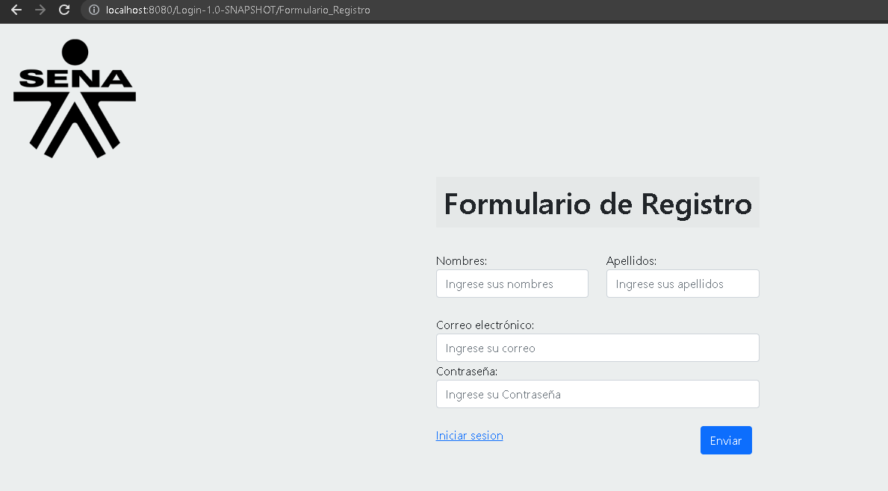
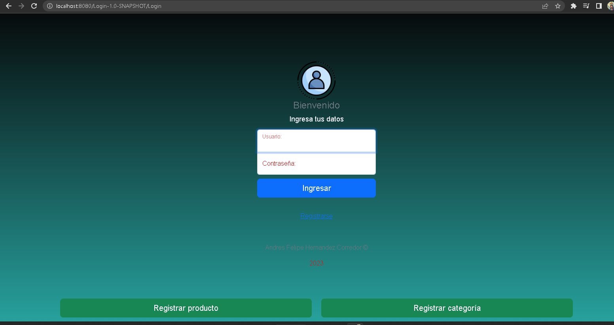
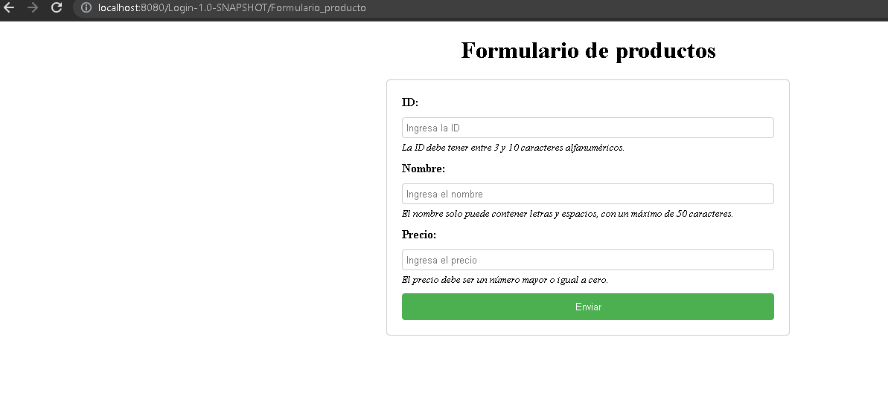
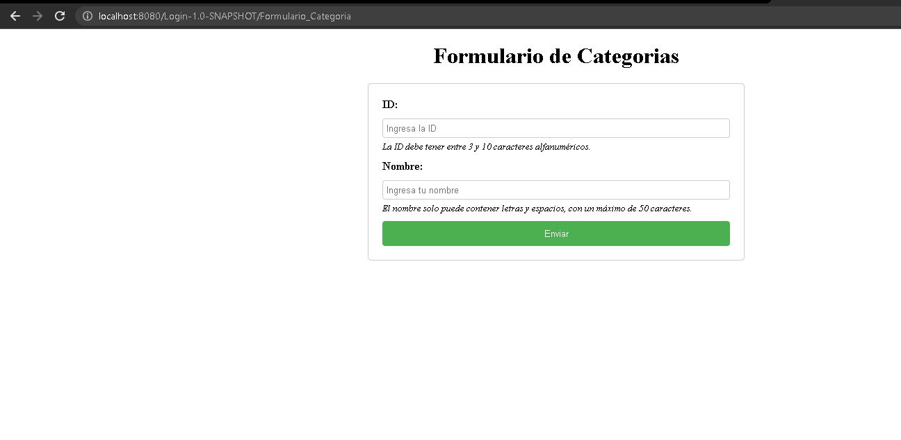

# Realizacion de Forwarding servlet 

## se implemento los servlet de forwarding a cada pagina como lo son 

- login
- Registro de usuario
- Registro de producto
- registro de categoria 

## Esto que permite ocultar la matriz de los archivos en la url de sitio web 

